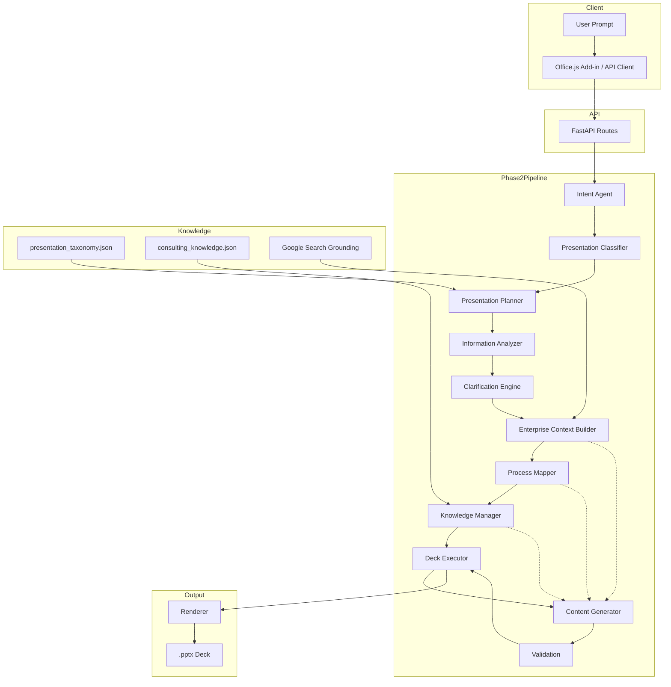

# EY AI Pitch — Architecture Reference

**Version:** 1.0  
**Status:** Sprint G.1  
**Audience:** AI engineers, backend engineers, product owners, and any contributor operating inside the EY AI Pitch codebase.

---

## 1. Product Overview

EY AI Pitch helps EY consultants produce executive-quality consulting presentations faster. It is not a generic slide generator; it is a reasoning pipeline that plans a consulting narrative, gathers enterprise context, maps business processes, applies curated consulting knowledge, and then generates structured slide content that renderers turn into PowerPoint files.

The product has evolved through two major phases:

- **Phase 1 — Single-slide generation.** Direct LLM planning → single renderer-ready spec → one `.pptx` slide. Fast but shallow.
- **Phase 2 — Consulting deck generation.** An orchestrated reasoning pipeline first decides what deck should exist, then plans its narrative, enriches it with enterprise and domain knowledge, and executes each slide independently. The final output is a complete consulting deck rendered into a single `.pptx` file.

The architectural North Star is separation of concerns:

> **The AI decides what the deck should say. The renderer decides how it looks.**

No AI module makes layout, color, font, or coordinate decisions. No renderer alters business content.

---

## 2. High-Level Architecture



### Pipeline stages

1. **Intent Agent** — classifies the raw request.
2. **Presentation Classifier** — selects the consulting presentation type.
3. **Presentation Planner** — produces a `DeckSpec` from the taxonomy scaffold.
4. **Information Analyzer** — checks whether enough information exists to proceed.
5. **Clarification Engine** — asks the minimum clarifying questions when needed.
6. **Enterprise Context Builder** — gathers grounded public company context.
7. **Process Mapper** — selects the enterprise process for the business function.
8. **Knowledge Manager** — retrieves curated consulting domain knowledge.
9. **Deck Executor** — iterates the `DeckSpec` and generates one slide at a time.
10. **Content Generator** — produces renderer-ready content for a single slide.
11. **Validation** — quality-gates each `SlideSpec`.
12. **Renderer** — turns validated `SlideSpec`s into PowerPoint objects.

---

## 3. Module Responsibilities

### Intent Agent

- **Purpose:** Classify the user's raw request into a normalised `IntentResult`.
- **Inputs:** `title: str`, `content: str`.
- **Outputs:** `IntentResult` (`slide_type`, `raw_title`, `raw_content`, `confidence`, `metadata`).
- **Dependencies:** None (keyword heuristic); `prompt_loader` for future LLM prompt.
- **LLM usage:** None in Sprint G.1; placeholder prompt loaded for future Sprint 1 LLM classifier.

### Presentation Classifier

- **Purpose:** Select the most appropriate consulting presentation type from the taxonomy.
- **Inputs:** `user_prompt: str`, `intent: IntentResult`.
- **Outputs:** `PresentationClassification` (`presentation_type`, `confidence`, `reasoning_summary`).
- **Dependencies:** `backend/knowledge/presentation_taxonomy.json` (read-only); `prompt_loader` for LLM fallback.
- **LLM usage:** Optional fallback only when deterministic confidence is below threshold.

### Presentation Planner

- **Purpose:** Plan the consulting narrative and slide sequence.
- **Inputs:** `user_prompt: str`, `intent: IntentResult`.
- **Outputs:** `DeckSpec` (`presentation_type`, `objective`, `audience`, `narrative`, `slides: list[SlidePlan]`).
- **Dependencies:** Presentation Classifier, `presentation_taxonomy.json`, `prompt_loader`.
- **LLM usage:** Adapts the taxonomy scaffold to the user's prompt; deterministic fallback uses taxonomy defaults.

### Information Analyzer

- **Purpose:** Deterministically assess whether enough information exists to plan a deck.
- **Inputs:** `user_prompt: str`, `intent: IntentResult`, `deck_spec: DeckSpec`.
- **Outputs:** `InformationResult` (`has_enough_information`, `missing_fields`, `analysis`, `confidence`).
- **Dependencies:** None.
- **LLM usage:** None.

### Clarification Engine

- **Purpose:** Generate the minimum number of clarification questions needed before planning.
- **Inputs:** `user_prompt: str`, `deck_spec: DeckSpec`, `information_result: InformationResult`.
- **Outputs:** `ClarificationResult` (`needs_clarification`, `content_questions`, `visualization_questions`).
- **Dependencies:** `prompt_loader` for optional visualization LLM; deterministic templates for content questions.
- **LLM usage:** Optional LLM for visualization ambiguity only.

### Enterprise Context Builder

- **Purpose:** Collect grounded public company context.
- **Inputs:** `intent: IntentResult`.
- **Outputs:** `EnterpriseContext` (`company`, `industry`, `business_function`, `company_summary`, `facts`, `sources`, `warnings`).
- **Dependencies:** `prompt_loader`; Google Search grounding.
- **LLM usage:** Gemini with Google Search grounding.

### Process Mapper

- **Purpose:** Select the standard enterprise process for the business function.
- **Inputs:** `intent: IntentResult`, `context: EnterpriseContext`.
- **Outputs:** `ProcessResult` (`process_name`, `process_family`, `confidence`, `reasoning`, `stages`).
- **Dependencies:** Hard-coded `_PROCESS_MAP` and aliases; `prompt_loader` for LLM fallback.
- **LLM usage:** Gemini fallback only when deterministic mapping fails.

### Knowledge Manager

- **Purpose:** Provide curated consulting domain knowledge.
- **Inputs:** `industry: str | None`, `business_function: str | None`.
- **Outputs:** `DomainKnowledge` (`domain`, `aliases`, `common_kpis`, `common_pain_points`, `transformation_themes`, `common_risks`).
- **Dependencies:** `backend/knowledge/consulting_knowledge.json`.
- **LLM usage:** None.

### Deck Executor

- **Purpose:** Execute a `DeckSpec` by generating one slide per `SlidePlan`.
- **Inputs:** `deck_spec: DeckSpec`, `intent: IntentResult`, `enterprise_context: EnterpriseContext`, `process_result: ProcessResult`.
- **Outputs:** `DeckExecutionResult` (list of `SlideExecutionResult`s, successful `SlideSpec`s, failures).
- **Dependencies:** Content Generator, Validation.
- **LLM usage:** None directly; delegates to Content Generator.

### Content Generator

- **Purpose:** Transform intent, context, process, knowledge, and an optional slide plan into a renderer-ready `SlideSpec`.
- **Inputs:** `intent: IntentResult`, `context: EnterpriseContext`, `process_result: ProcessResult`, optional `slide_plan: SlidePlan`.
- **Outputs:** `SlideSpec` (`slide_type`, `raw_spec`, `version`, `generated_by`).
- **Dependencies:** Knowledge Manager, `prompt_loader`.
- **LLM usage:** Gemini for slide content; deterministic fallback when LLM fails.

### Validation

- **Purpose:** Quality-gate a `SlideSpec` before rendering.
- **Inputs:** `spec: SlideSpec`.
- **Outputs:** `ValidationResult` (`is_valid`, `issues`, `claims`, `validated_spec`).
- **Dependencies:** `prompt_loader` for future validation prompt.
- **LLM usage:** None in Sprint G.1; placeholder pass-through.

### Renderer

- **Purpose:** Translate `SlideSpec.raw_spec` into PowerPoint objects.
- **Inputs:** `raw_spec: dict`, optional shared `Presentation`.
- **Outputs:** `.pptx` file.
- **Dependencies:** `python-pptx`.
- **LLM usage:** None.

---

## 4. Schema Reference

### IntentResult

Output of the Intent Agent. Captures what the user wants before any content is generated.

| Field | Type | Description |
|-------|------|-------------|
| `slide_type` | `str` | Normalised type: `operating_model`, `process_flow`, `comparison`, `current_future`, `unknown`. |
| `raw_title` | `str` | Original title string. |
| `raw_content` | `str` | Original content string. |
| `company` | `str \| None` | Detected company. |
| `industry` | `str \| None` | Detected industry. |
| `business_function` | `str \| None` | Detected business function. |
| `confidence` | `float` | Intent classification confidence [0.0, 1.0]. |
| `metadata` | `dict` | Extensible metadata bag. |

### PresentationClassification

Output of the Presentation Classifier.

| Field | Type | Description |
|-------|------|-------------|
| `presentation_type` | `str` | Selected taxonomy type, e.g. `Transformation Proposal`. |
| `confidence` | `float` | Classification confidence [0.0, 1.0]. |
| `reasoning_summary` | `str` | Why this type was selected. |

### DeckSpec

Output of the Presentation Planner. A pure planning artifact with no slide content.

| Field | Type | Description |
|-------|------|-------------|
| `presentation_type` | `str` | Classified deck type. |
| `objective` | `str` | Single decision or alignment the deck must produce. |
| `audience` | `str` | Intended audience. |
| `narrative` | `str` | Consulting storyline across slides. |
| `estimated_slide_count` | `int` | Expected number of slides. |
| `slides` | `list[SlidePlan]` | Ordered slide plans. |

### SlidePlan

A single slide inside a `DeckSpec`.

| Field | Type | Description |
|-------|------|-------------|
| `slide_number` | `int` | 1-indexed position. |
| `slide_role` | `str` | Consulting role, e.g. `Executive Summary`, `Current State`. |
| `purpose` | `str` | What this slide must communicate. |
| `required_inputs` | `list[str]` | Information needed to generate this slide. |
| `dependencies` | `list[str]` | Slide roles this slide depends on. |
| `visualization_type` | `str` | Semantic visual recommendation. |

### EnterpriseContext

Output of the Enterprise Context Builder.

| Field | Type | Description |
|-------|------|-------------|
| `company` | `str` | Company being researched. |
| `industry` | `str` | Industry vertical. |
| `business_function` | `str` | Business function in scope. |
| `company_summary` | `str` | Concise factual summary. |
| `facts` | `list[ResearchFact]` | Grounded factual statements. |
| `sources` | `list[ResearchSource]` | Public sources. |
| `warnings` | `list[str]` | Non-fatal warnings. |
| `enrichment_metadata` | `dict` | Provenance tracing. |

### ProcessResult

Output of the Process Mapper.

| Field | Type | Description |
|-------|------|-------------|
| `process_name` | `str` | Canonical enterprise process. |
| `process_family` | `str` | Business function or process family. |
| `confidence` | `float` | Mapping confidence. |
| `reasoning` | `str` | Why this process was selected. |
| `stages` | `list[str]` | High-level process stages. |

### DomainKnowledge

Output of the Knowledge Manager.

| Field | Type | Description |
|-------|------|-------------|
| `domain` | `str` | Canonical domain name. |
| `aliases` | `list[str]` | Alternative names. |
| `common_kpis` | `list[str]` | Representative KPIs. |
| `common_pain_points` | `list[str]` | Typical challenges. |
| `transformation_themes` | `list[str]` | Common improvement levers. |
| `common_risks` | `list[str]` | Domain risks to consider. |

### SlideSpec

Canonical contract between the orchestrator and the renderer.

| Field | Type | Description |
|-------|------|-------------|
| `slide_type` | `str` | Renderer selector: `operating_model`, `process_flow`, etc. |
| `raw_spec` | `dict` | Renderer-ready payload. |
| `version` | `str` | Spec format version. |
| `generated_by` | `str` | Component identifier. |

### ValidationResult

Output of the Validation module.

| Field | Type | Description |
|-------|------|-------------|
| `is_valid` | `bool` | Whether the spec is safe to render. |
| `issues` | `list[str]` | Human-readable issues. |
| `claims` | `list[ClaimMetadata]` | Per-claim quality metadata. |
| `validated_spec` | `SlideSpec \| None` | Validated spec, or `None` on fatal rejection. |

### DeckExecutionResult

Output of the Deck Executor (Sprint G.1).

| Field | Type | Description |
|-------|------|-------------|
| `deck_spec` | `DeckSpec` | Original deck plan. |
| `slides` | `list[SlideExecutionResult]` | Per-slide outcomes. |
| `successful_slides` | `list[SlideSpec]` | Specs that passed validation. |
| `failed_slides` | `list[SlideExecutionResult]` | Specs that failed or were invalid. |
| `all_succeeded` | `bool` | True if every slide succeeded. |
| `partial_success` | `bool` | True if at least one slide succeeded and at least one failed. |

---

## 5. Knowledge Sources

### `presentation_taxonomy.json`

Curated consulting presentation taxonomy. Defines presentation types (`Transformation Proposal`, `AI Strategy`, `Board Update`, etc.), each with:

- Description, objective, expected audience, consulting narrative.
- Default slide sequence.
- Visualization preferences.
- Optional slides and variants.
- Business-function applicability.

Used by the Presentation Planner as the narrative scaffold.

### `consulting_knowledge.json`

Curated consulting domain knowledge. Organised by business function (`Finance`, `Procurement`, `Human Resources`, `Supply Chain`, `Manufacturing`, `AI`), each with:

- Common KPIs
- Common pain points
- Transformation themes
- Common risks

Used by the Content Generator as grounding after enterprise context and process mapping.

### Google Search Grounding

The Enterprise Context Builder uses Gemini with Google Search grounding to collect public company facts from official websites, annual reports, investor relations, earnings reports, and SEC filings. Every fact carries a source name and URL.

### Enterprise Context

`EnterpriseContext` carries verified public facts about the company. It is the highest-priority grounding source for content generation.

### Process Mapping

`ProcessResult` provides the enterprise process structure (process name, family, stages). It shapes the operating model and process flow content.

### Knowledge Flow

```text
EnterpriseContext  ──► Content Generator (highest priority)
ProcessResult      ──► Content Generator
DomainKnowledge    ──► Content Generator
Model prior        ──► Content Generator (lowest priority)
```

---

## 6. Prompt Architecture

Prompts are centralised under `backend/ai/`.

### `instructions.md`

Global governing specification for all AI modules. Defines:

- Product mission
- AI roles and non-roles
- Instruction hierarchy
- Reason → Plan → Present lifecycle
- Core operating principles
- Agent responsibility boundaries
- Consulting and enterprise knowledge principles
- Output standards

### Module prompts (`backend/ai/prompts/*.md`)

Per-module instructions:

- `intent.md`
- `context.md`
- `process.md`
- `content.md`
- `slide_content.md` (Sprint G.1)
- `presentation_planner.md`
- `presentation_classifier.md`
- `validation.md`
- `clarification.md`
- `information_analyzer.md`

### `prompt_loader.py`

`backend/llm/prompt_loader.py` loads `instructions.md` once at startup and composes prompts on demand:

```text
GLOBAL INSTRUCTIONS
    instructions.md

MODULE INSTRUCTIONS
    <module>.md

MODULE INPUT
    dynamic JSON context
```

Module prompts are registered in `_MODULE_FILES`.

### Dynamic context

Each LLM call receives a JSON-serialised context block containing the relevant inputs (intent, enterprise context, process result, domain knowledge, slide plan, etc.).

---

## 7. Pipeline Flow

### Current Production Pipeline (Sprint G.1)

```text
POST /generate/v2
    │
    ▼
extract_intent(title, content) → IntentResult
    │
    ▼
plan_presentation(content, intent) → DeckSpec
    │
    ▼
build_context(intent) → EnterpriseContext
    │
    ▼
identify_process(intent, context) → ProcessResult
    │
    ▼
generate_content(intent, context, process_result) → SlideSpec
    │
    ▼
validate_content(spec) → ValidationResult
    │
    ▼
renderer.render(spec.raw_spec) → generated_slide_v2.pptx
```

`DeckSpec` is produced but only one slide is generated and rendered.

### Future Production Pipeline (Sprint G.2+)

```text
POST /generate/v2
    │
    ▼
extract_intent(title, content) → IntentResult
    │
    ▼
classify_presentation(content, intent) → PresentationClassification
    │
    ▼
plan_presentation(content, intent) → DeckSpec
    │
    ▼
analyze_information(content, intent, deck_spec) → InformationResult
    │
    ▼
generate_clarifications(content, deck_spec, info_result) → ClarificationResult
    │   (future: return questions to client when needed)
    ▼
build_context(intent) → EnterpriseContext
    │
    ▼
identify_process(intent, context) → ProcessResult
    │
    ▼
get_knowledge(context.industry, intent.business_function) → DomainKnowledge
    │
    ▼
execute_deck(deck_spec, intent, context, process_result) → DeckExecutionResult
    │   (calls generate_slide_content per SlidePlan + validate per slide)
    ▼
renderer.render_deck(deck_result.successful_slides) → generated_slide_v2.pptx
```

---

## 8. Future Roadmap

### Deck Executor (Sprint G.1)

- Introduce `execute_deck()` and `DeckExecutionResult`.
- Generate each slide independently.
- Continue execution on individual slide failures.
- Remain internal to the pipeline; not yet the production path.

### Deck Executor Integration (Sprint G.2)

- Wire `execute_deck()` into `orchestrator.run_pipeline()`.
- Update `slide_service.generate_slide_v2()` to render full decks.
- Extend renderers with `render(..., presentation=None)` to support shared presentations.

### Regeneration

- Support scoped regeneration: single slide, subset of slides, full deck, visualization-only, content-only.
- Preserve validated content not explicitly targeted.

### Validation

- Replace placeholder validator with structural and semantic checks.
- Verify claims against `EnterpriseContext.facts`.
- Detect hallucinations and unsupported numeric claims.
- Cross-slide consistency checks.

### EY Template Integration

- Map `DeckSpec`/`SlidePlan` to EY template families.
- Auto-select template based on presentation type and audience.
- Keep renderer/template logic separate from AI reasoning.

### Clarification Loop

- Fully wire Clarification Engine into the orchestrator.
- Return clarification questions via API when information is insufficient.
- Resume pipeline after client answers.
