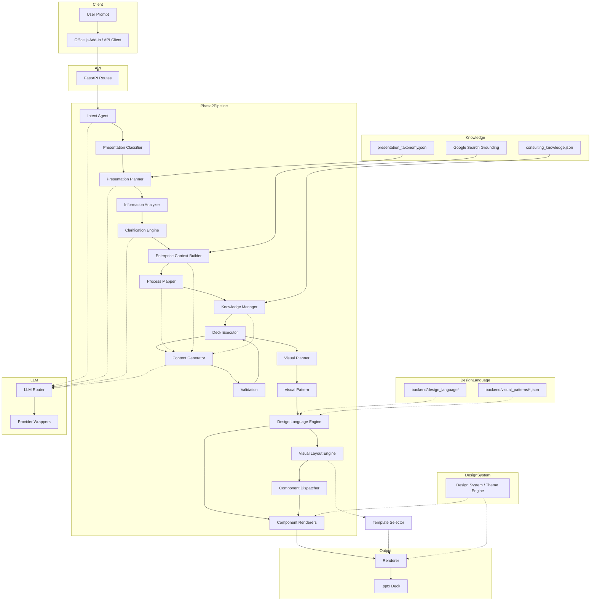

# EY AI Pitch — Architecture Reference

**Version:** 1.0  
**Status:** Sprint I1 (Visual Pipeline integration into `/generate/v2`)  
**Audience:** AI engineers, backend engineers, product owners, and any contributor operating inside the EY AI Pitch codebase.

---

## 1. Product Overview

EY AI Pitch helps EY consultants produce executive-quality consulting presentations faster. It is not a generic slide generator; it is a reasoning pipeline that plans a consulting narrative, gathers enterprise context, maps business processes, applies curated consulting knowledge, and then generates structured slide content that renderers turn into PowerPoint files.

The product has evolved through two major phases:

- **Phase 1 — Single-slide generation.** Direct LLM planning → single renderer-ready spec → one `.pptx` slide. Fast but shallow.
- **Phase 2 — Consulting deck generation.** An orchestrated reasoning pipeline first decides what deck should exist, then plans its narrative, enriches it with enterprise and domain knowledge, and executes each slide independently. The final output is a complete consulting deck rendered into a single `.pptx` file.

The architectural North Star is separation of concerns:

> **The AI decides what the deck should say. The renderer decides how it looks.**

No AI module makes layout, color, font, or coordinate decisions. No renderer alters business content.

---

## 2. High-Level Architecture



### Pipeline stages

1. **Intent Agent** — extracts structured intent (company, industry, business function, audience, objective, slide type) from the raw request.
2. **Presentation Classifier** — selects the consulting presentation type.
3. **Presentation Planner** — produces a `DeckSpec` from the taxonomy scaffold.
4. **Information Analyzer** — checks whether enough information exists to proceed.
5. **Clarification Engine** — asks the minimum clarifying questions when needed.
6. **Enterprise Context Builder** — gathers grounded public company context.
7. **Process Mapper** — selects the enterprise process for the business function.
8. **Knowledge Manager** — retrieves curated consulting domain knowledge.
9. **Deck Executor** — iterates the `DeckSpec` and generates one slide at a time.
10. **Content Generator** — produces renderer-ready content for a single slide.
11. **Validation** — quality-gates each `SlideSpec`.
12. **Renderer** — turns validated `SlideSpec`s into PowerPoint objects.

---

## 3. Module Responsibilities

### Intent Agent

- **Purpose:** Extract structured intent from the user's raw request. The result is the canonical source of truth for company, industry, business function, audience, objective, and slide type.
- **Inputs:** `title: str`, `content: str`.
- **Outputs:** `IntentResult` (`slide_type`, `raw_title`, `raw_content`, `company`, `industry`, `business_function`, `audience`, `objective`, `confidence`, `metadata`).
- **Dependencies:** `backend/modules/intent_entity_extractor.py`; `backend/knowledge/intent_entities.json`; `prompt_loader` for the LLM fallback prompt; `backend/llm/router.py` for the LLM fallback call.
- **LLM usage:** None for the primary deterministic path. Optional LLM fallback (routed through the Multi-Provider LLM Router) only when deterministic extraction confidence is below the threshold.

#### Intelligent Intent Extraction layer

The Intent Agent now uses a two-tier extraction strategy that mirrors the Presentation Classifier and Visual Planner:

```text
User Prompt (title + content)
         │
         ▼
┌─────────────────────┐
│ Deterministic       │  regex + keyword maps + alias tables
│ Entity Extractor    │  from intent_entities.json
└─────────────────────┘
         │
         ▼
High confidence? ──Yes──► return populated IntentResult
         │
         No
         ▼
┌─────────────────────┐
│ LLM Enrichment      │  existing intent.md prompt
│ (router fallback)   │  fills missing / low-confidence fields
└─────────────────────┘
         │
         ▼
        Merge deterministic + LLM results
         │
         ▼
      IntentResult
```

Responsibilities:

- **`backend/modules/intent_entity_extractor.py`** — loads `intent_entities.json`, normalizes text, and extracts:
  - **Company** via regex (supports possessives such as "Microsoft's").
  - **Industry** via keyword/alias matching and a small known-companies table.
  - **Business Function** via keyword/alias matching.
  - **Audience** via keyword/alias matching.
  - **Objective** via heuristic sentence cleanup.
- **`backend/knowledge/intent_entities.json`** — reusable, prompt-independent mappings for industries, business functions, audiences, known companies, and company-stop phrases.
- **`backend/modules/intent.py::extract_intent()`** — orchestrates deterministic extraction, decides whether LLM enrichment is needed, merges results, and returns the canonical `IntentResult`.

All downstream modules consume the same `IntentResult` schema; no downstream changes are required.

### Presentation Classifier

- **Purpose:** Select the most appropriate consulting presentation type from the taxonomy.
- **Inputs:** `user_prompt: str`, `intent: IntentResult`.
- **Outputs:** `PresentationClassification` (`presentation_type`, `confidence`, `reasoning_summary`).
- **Dependencies:** `backend/knowledge/presentation_taxonomy.json` (read-only); `prompt_loader` for LLM fallback.
- **LLM usage:** Optional fallback only when deterministic confidence is below threshold.

### Presentation Planner

- **Purpose:** Plan the consulting narrative and slide sequence.
- **Inputs:** `user_prompt: str`, `intent: IntentResult`.
- **Outputs:** `DeckSpec` (`presentation_type`, `objective`, `audience`, `narrative`, `slides: list[SlidePlan]`).
- **Dependencies:** Presentation Classifier, `presentation_taxonomy.json`, `prompt_loader`, `backend/llm/router.py`.
- **LLM usage:** Adapts the taxonomy scaffold to the user's prompt via the Multi-Provider LLM Router; deterministic fallback uses taxonomy defaults.

### Information Analyzer

- **Purpose:** Deterministically assess whether enough information exists to plan a deck.
- **Inputs:** `user_prompt: str`, `intent: IntentResult`, `deck_spec: DeckSpec`.
- **Outputs:** `InformationResult` (`has_enough_information`, `missing_fields`, `analysis`, `confidence`).
- **Dependencies:** None.
- **LLM usage:** None.

### Clarification Engine

- **Purpose:** Generate the minimum number of clarification questions needed before planning.
- **Inputs:** `user_prompt: str`, `deck_spec: DeckSpec`, `information_result: InformationResult`.
- **Outputs:** `ClarificationResult` (`needs_clarification`, `content_questions`, `visualization_questions`).
- **Dependencies:** `prompt_loader` for optional visualization LLM; deterministic templates for content questions; `backend/llm/router.py`.
- **LLM usage:** Optional LLM for visualization ambiguity only, routed through the Multi-Provider LLM Router.

### Enterprise Context Builder

- **Purpose:** Collect grounded public company context.
- **Inputs:** `intent: IntentResult`.
- **Outputs:** `EnterpriseContext` (`company`, `industry`, `business_function`, `company_summary`, `facts`, `sources`, `warnings`).
- **Dependencies:** `prompt_loader`; Google Search grounding.
- **LLM usage:** Gemini with Google Search grounding.

### Process Mapper

- **Purpose:** Select the standard enterprise process for the business function.
- **Inputs:** `intent: IntentResult`, `context: EnterpriseContext`.
- **Outputs:** `ProcessResult` (`process_name`, `process_family`, `confidence`, `reasoning`, `stages`).
- **Dependencies:** Hard-coded `_PROCESS_MAP` and aliases; `prompt_loader` for LLM fallback.
- **LLM usage:** Gemini fallback only when deterministic mapping fails.

### Knowledge Manager

- **Purpose:** Provide curated consulting domain knowledge.
- **Inputs:** `industry: str | None`, `business_function: str | None`.
- **Outputs:** `DomainKnowledge` (`domain`, `aliases`, `common_kpis`, `common_pain_points`, `transformation_themes`, `common_risks`).
- **Dependencies:** `backend/knowledge/consulting_knowledge.json`.
- **LLM usage:** None.

### Deck Executor

- **Purpose:** Execute a `DeckSpec` by generating one slide per `SlidePlan`.
- **Inputs:** `deck_spec: DeckSpec`, `intent: IntentResult`, `enterprise_context: EnterpriseContext`, `process_result: ProcessResult`.
- **Outputs:** `DeckExecutionResult` (list of `SlideExecutionResult`s, successful `SlideSpec`s, failures).
- **Dependencies:** Content Generator, Validation.
- **LLM usage:** None directly; delegates to Content Generator.

### Content Generator

- **Purpose:** Transform intent, context, process, knowledge, and an optional slide plan into a renderer-ready `SlideSpec`. When a `VisualPatternSelection` is provided, the generator emits pattern-native content (cards, KPIs, columns, timeline events, roadmap phases, process steps, matrix cells, journey stages, capability domains) in addition to the base operating-model fields.
- **Inputs:** `intent: IntentResult`, `context: EnterpriseContext`, `process_result: ProcessResult`, optional `slide_plan: SlidePlan`, optional `visual_pattern_selection: VisualPatternSelection`.
- **Outputs:** `SlideSpec` (`slide_type`, `raw_spec`, `version`, `generated_by`).
- **Dependencies:** Knowledge Manager, Visual Planner (when auto-selecting a pattern), `prompt_loader`, `backend/llm/router.py`.
- **LLM usage:** Routed through the Multi-Provider LLM Router for slide content; deterministic fallback when LLM fails.

### Multi-Provider LLM Router

- **Purpose:** Provide a single entry point for all LLM calls from business modules. Modules request `generate_json(module_name, prompt, ...)` and the router selects the provider, retries transient failures, falls back through a configured priority list, and returns normalized JSON.
- **Inputs:** `module_name: str`, `prompt: str`, plus optional generation parameters.
- **Outputs:** Parsed `dict[str, Any]`.
- **Dependencies:** `backend/llm/config.py` (provider routing and model names), `backend/llm/providers/gemini.py`, `backend/llm/providers/openai_compatible.py`.
- **Behavior:**
  - Provider priority is configured per module in `MODEL_ROUTING`.
  - The router reuses the same provider for a module within a deck generation session (via `set_router_context()` / `clear_router_context()` or a module-level TTL cache).
  - Retries are performed only for transient errors (`429`, `503`, timeouts, connection resets).
  - Missing API keys cause the router to skip that provider and try the next.
  - Provider-specific SDK imports are isolated in wrapper modules; business modules no longer import them.
- **LLM usage:** This module is the abstraction layer; it delegates to Gemini, OpenAI, Groq, Cerebras, or OpenRouter.

### Visual Planner

- **Purpose:** Decide *how* a slide's content should be communicated visually by selecting a reusable `VisualPattern`.
- **Inputs:** `slide_plan: SlidePlan`, `slide_spec: SlideSpec`.
- **Outputs:** `VisualPatternSelection` (`pattern_id`, `category`, `confidence`, `reasoning`, `recommended_variant`).
- **Dependencies:** `backend/visual_patterns/creative_patterns.json`, `backend/visual_patterns/infographic_patterns.json`.
- **LLM usage:** None; deterministic keyword and content-based scoring.

### Design Language Engine

- **Purpose:** Capture reusable consulting visual-language rules (spacing, alignment, hierarchy, emphasis, whitespace, icon sizing) independently of any PowerPoint template. Templates are reference material only; the engine never loads or populates them.
- **Inputs:** Optional `pattern_id` for pattern-specific lookups.
- **Outputs:** Normalized design rules consumed by the Layout Engine and Component Renderers.
- **Dependencies:** `backend/design_language/*.json` (generic rules), optional `design_metadata` embedded in `backend/visual_patterns/*.json` (pattern-specific overrides).
- **Lookup precedence:**
  1. Pattern-specific overrides from `backend/design_language/creative_listings.json` / `infographics.json`.
  2. Optional `design_metadata` from the visual pattern registry.
  3. Generic rule files (`spacing.json`, `alignment.json`, `hierarchy.json`, `emphasis.json`, `visual_rules.json`).
  4. Sensible default fallback that preserves the previous rendering behavior.
- **LLM usage:** None.

### Visual Layout Engine

- **Purpose:** Translate a selected `VisualPattern` into a normalized `LayoutSpecification`. It defines *where* each piece of content belongs on the slide without drawing PowerPoint shapes.
- **Inputs:** `visual_pattern_selection: VisualPatternSelection`.
- **Outputs:** `LayoutSpecification` (`layout_id`, `visual_pattern`, `header`, `body`, `footer`, `components`, spacing, alignment, etc.).
- **Dependencies:** `backend/layouts/creative/*.json`, `backend/layouts/infographic/*.json`, `backend/layouts/generic.json`.
- **LLM usage:** None.

### Component Dispatcher

- **Purpose:** Inspect each ``ComponentSpecification.type`` and route it to the correct component renderer.
- **Inputs:** `component_specification: ComponentSpecification`, `presentation: Presentation`, `slide: Slide`, `content: dict`, optional `layout_context: dict` (carries the visual `pattern_id`).
- **Outputs:** PowerPoint shapes added to the slide.
- **Dependencies:** Component renderer modules under `ppt_renderer/components/`.
- **LLM usage:** None.

### Component Renderers

- **Purpose:** Draw individual visual elements (cards, timeline nodes, matrix cells, icons, headers, footers) using normalized coordinates and design-language rules.
- **Inputs:** `component_specification`, `presentation`, `slide`, `content`, optional `layout_context: dict`.
- **Outputs:** PowerPoint shapes added to the slide.
- **Dependencies:** `backend/design_system/theme_loader.py`, `backend/design_system/design_language.py`, `ppt_renderer/components/coordinates.py`, `ppt_renderer/components/placeholder_resolver.py`.
- **Behavior:** Renderers query the Design Language Engine for structural values (spacing, alignment, icon sizing, hierarchy) and fall back to previous hardcoded or theme values when a rule is missing. Colors, fonts, and font sizes continue to come from the active theme unless overridden by design-language hierarchy rules.
- **LLM usage:** None.

### Executive Insight Card (Design Sprint D1)

- **Purpose:** The first production-quality reusable Design System component. It is the default card for Executive Summary, Key Benefits, Strategic Pillars, Business Outcomes, Value Drivers, Recommendations, Risks, and Opportunities.
- **Renderer:** `ppt_renderer/components/executive_card_renderer.py`.
- **Content schema:** `schemas/executive_card.py` (`ExecutiveCardContent`).
- **Supported fields:** title, description, optional icon placeholder, optional metric, optional tag, optional highlight badge, optional priority hint.
- **Behavior:** Renders inside normalized bounds from the Layout Engine; supports 1–4 card groupings through equal-width component specifications; adapts internal spacing and optional fields based on the active theme.
- **Future reuse:** Creative Listing layouts (e.g., Four Insight Cards, Three Strategy Cards, Executive Summary Cards) should reuse this component instead of introducing custom card layouts.
- **LLM usage:** None.

### Design System / Theme Engine

- **Purpose:** Provide the single source of truth for styling tokens: color palette, typography, spacing, borders, and theme metadata. Component renderers consume the active theme instead of hardcoding RGB values, font sizes, or margins.
- **Inputs:** Theme name (e.g., ``"ey_blue"`` or ``"ey_parthenon"``).
- **Outputs:** `DesignTheme` with accessor methods for colors, fonts, sizes, and spacing.
- **Dependencies:** `backend/themes/*.json`, `schemas/theme.py`.
- **LLM usage:** None.

### Validation

- **Purpose:** Quality-gate a `SlideSpec` before rendering.
- **Inputs:** `spec: SlideSpec`.
- **Outputs:** `ValidationResult` (`is_valid`, `issues`, `claims`, `validated_spec`).
- **Dependencies:** `prompt_loader` for future validation prompt.
- **LLM usage:** None in Sprint G.1; placeholder pass-through.

### Renderer

- **Purpose:** Translate `SlideSpec.raw_spec` into PowerPoint objects.
- **Inputs:** `raw_spec: dict`, optional shared `Presentation`, optional `layout_spec: LayoutSpecification`.
- **Outputs:** `.pptx` file.
- **Dependencies:** `python-pptx`, component renderers when `layout_spec` is provided.
- **Behavior:** When `layout_spec` is omitted, renderers use their legacy hardcoded layout. When `layout_spec` is provided, renderers delegate header, footer, and components to the Component Dispatcher. The renderer passes the visual `pattern_id` from `layout_spec.visual_pattern` through `layout_context` so component renderers can apply pattern-specific design-language rules.
- **LLM usage:** None.

---

## 4. Schema Reference

### IntentResult

Output of the Intent Agent. Captures what the user wants before any content is generated.

| Field | Type | Description |
|-------|------|-------------|
| `slide_type` | `str` | Normalised type: `operating_model`, `process_flow`, `comparison`, `current_future`, `unknown`. |
| `raw_title` | `str` | Original title string. |
| `raw_content` | `str` | Original content string. |
| `company` | `str \| None` | Detected company. |
| `industry` | `str \| None` | Detected industry. |
| `business_function` | `str \| None` | Detected business function. |
| `audience` | `str \| None` | Detected audience. |
| `objective` | `str \| None` | Detected objective or topic. |
| `confidence` | `float` | Overall intent extraction confidence [0.0, 1.0]. |
| `metadata` | `dict` | Extensible metadata bag; includes `extraction_source` (`deterministic` or `hybrid`). |

### PresentationClassification

Output of the Presentation Classifier.

| Field | Type | Description |
|-------|------|-------------|
| `presentation_type` | `str` | Selected taxonomy type, e.g. `Transformation Proposal`. |
| `confidence` | `float` | Classification confidence [0.0, 1.0]. |
| `reasoning_summary` | `str` | Why this type was selected. |

### DeckSpec

Output of the Presentation Planner. A pure planning artifact with no slide content.

| Field | Type | Description |
|-------|------|-------------|
| `presentation_type` | `str` | Classified deck type. |
| `objective` | `str` | Single decision or alignment the deck must produce. |
| `audience` | `str` | Intended audience. |
| `narrative` | `str` | Consulting storyline across slides. |
| `estimated_slide_count` | `int` | Expected number of slides. |
| `slides` | `list[SlidePlan]` | Ordered slide plans. |

### SlidePlan

A single slide inside a `DeckSpec`.

| Field | Type | Description |
|-------|------|-------------|
| `slide_number` | `int` | 1-indexed position. |
| `slide_role` | `str` | Consulting role, e.g. `Executive Summary`, `Current State`. |
| `purpose` | `str` | What this slide must communicate. |
| `required_inputs` | `list[str]` | Information needed to generate this slide. |
| `dependencies` | `list[str]` | Slide roles this slide depends on. |
| `visualization_type` | `str` | Semantic visual recommendation. |

### EnterpriseContext

Output of the Enterprise Context Builder.

| Field | Type | Description |
|-------|------|-------------|
| `company` | `str` | Company being researched. |
| `industry` | `str` | Industry vertical. |
| `business_function` | `str` | Business function in scope. |
| `company_summary` | `str` | Concise factual summary. |
| `facts` | `list[ResearchFact]` | Grounded factual statements. |
| `sources` | `list[ResearchSource]` | Public sources. |
| `warnings` | `list[str]` | Non-fatal warnings. |
| `enrichment_metadata` | `dict` | Provenance tracing. |

### ProcessResult

Output of the Process Mapper.

| Field | Type | Description |
|-------|------|-------------|
| `process_name` | `str` | Canonical enterprise process. |
| `process_family` | `str` | Business function or process family. |
| `confidence` | `float` | Mapping confidence. |
| `reasoning` | `str` | Why this process was selected. |
| `stages` | `list[str]` | High-level process stages. |

### DomainKnowledge

Output of the Knowledge Manager.

| Field | Type | Description |
|-------|------|-------------|
| `domain` | `str` | Canonical domain name. |
| `aliases` | `list[str]` | Alternative names. |
| `common_kpis` | `list[str]` | Representative KPIs. |
| `common_pain_points` | `list[str]` | Typical challenges. |
| `transformation_themes` | `list[str]` | Common improvement levers. |
| `common_risks` | `list[str]` | Domain risks to consider. |

### SlideSpec

Canonical contract between the orchestrator and the renderer.

| Field | Type | Description |
|-------|------|-------------|
| `slide_type` | `str` | Renderer selector: `operating_model`, `process_flow`, etc. |
| `raw_spec` | `dict` | Renderer-ready payload. |
| `version` | `str` | Spec format version. |
| `generated_by` | `str` | Component identifier. |

### ValidationResult

Output of the Validation module.

| Field | Type | Description |
|-------|------|-------------|
| `is_valid` | `bool` | Whether the spec is safe to render. |
| `issues` | `list[str]` | Human-readable issues. |
| `claims` | `list[ClaimMetadata]` | Per-claim quality metadata. |
| `validated_spec` | `SlideSpec \| None` | Validated spec, or `None` on fatal rejection. |

### DeckExecutionResult

Output of the Deck Executor (Sprint G.1).

| Field | Type | Description |
|-------|------|-------------|
| `deck_spec` | `DeckSpec` | Original deck plan. |
| `slides` | `list[SlideExecutionResult]` | Per-slide outcomes. |
| `successful_slides` | `list[SlideSpec]` | Specs that passed validation. |
| `failed_slides` | `list[SlideExecutionResult]` | Specs that failed or were invalid. |
| `all_succeeded` | `bool` | True if every slide succeeded. |
| `partial_success` | `bool` | True if at least one slide succeeded and at least one failed. |

---

## 5. Knowledge Sources

### `presentation_taxonomy.json`

Curated consulting presentation taxonomy. Defines presentation types (`Transformation Proposal`, `AI Strategy`, `Board Update`, etc.), each with:

- Description, objective, expected audience, consulting narrative.
- Default slide sequence.
- Visualization preferences.
- Optional slides and variants.
- Business-function applicability.

Used by the Presentation Planner as the narrative scaffold.

### `consulting_knowledge.json`

Curated consulting domain knowledge. Organised by business function (`Finance`, `Procurement`, `Human Resources`, `Supply Chain`, `Manufacturing`, `AI`), each with:

- Common KPIs
- Common pain points
- Transformation themes
- Common risks

Used by the Content Generator as grounding after enterprise context and process mapping.

### Google Search Grounding

The Enterprise Context Builder uses Gemini with Google Search grounding to collect public company facts from official websites, annual reports, investor relations, earnings reports, and SEC filings. Every fact carries a source name and URL.

### Enterprise Context

`EnterpriseContext` carries verified public facts about the company. It is the highest-priority grounding source for content generation.

### Process Mapping

`ProcessResult` provides the enterprise process structure (process name, family, stages). It shapes the operating model and process flow content.

### Knowledge Flow

```text
EnterpriseContext  ──► Content Generator (highest priority)
ProcessResult      ──► Content Generator
DomainKnowledge    ──► Content Generator
Model prior        ──► Content Generator (lowest priority)
```

---

## 6. Prompt Architecture

Prompts are centralised under `backend/ai/`.

### `instructions.md`

Global governing specification for all AI modules. Defines:

- Product mission
- AI roles and non-roles
- Instruction hierarchy
- Reason → Plan → Present lifecycle
- Core operating principles
- Agent responsibility boundaries
- Consulting and enterprise knowledge principles
- Output standards

### Module prompts (`backend/ai/prompts/*.md`)

Per-module instructions:

- `intent.md`
- `context.md`
- `process.md`
- `content.md`
- `slide_content.md` (Sprint G.1)
- `presentation_planner.md`
- `presentation_classifier.md`
- `validation.md`
- `clarification.md`
- `information_analyzer.md`

### `prompt_loader.py`

`backend/llm/prompt_loader.py` loads `instructions.md` once at startup and composes prompts on demand:

```text
GLOBAL INSTRUCTIONS
    instructions.md

MODULE INSTRUCTIONS
    <module>.md

MODULE INPUT
    dynamic JSON context
```

Module prompts are registered in `_MODULE_FILES`.

### Dynamic context

Each LLM call receives a JSON-serialised context block containing the relevant inputs (intent, enterprise context, process result, domain knowledge, slide plan, etc.).

---

## 7. Pipeline Flow

### Current Production Pipeline (Sprint I3)

```text
POST /generate/v2
    │
    ▼
extract_intent(title, content) → IntentResult
    │
    ▼
classify_presentation(content, intent) → PresentationClassification
    │
    ▼
plan_presentation(content, intent) → DeckSpec
    │
    ▼
analyze_information(content, intent, deck_spec) → InformationResult
    │
    ▼
generate_clarifications(content, deck_spec, info_result) → ClarificationResult
    │   (returns questions to client when needed)
    ▼
build_context(intent) → EnterpriseContext
    │
    ▼
identify_process(intent, context) → ProcessResult
    │
    ▼
get_knowledge(context.industry, intent.business_function) → DomainKnowledge
    │
    ▼
execute_deck(deck_spec, intent, context, process_result) → DeckExecutionResult
    │   (calls generate_slide_content per SlidePlan + validate per slide)
    ▼
for each SlidePlan:
    │
    ├── generate_slide_content(..., visual_pattern_selection=optional) → SlideSpec
    │       (auto-selects a VisualPatternSelection via plan_visual_pattern() when none is provided)
    │
    ├── validate(slide_spec) → ValidationResult
    ▼
for each successful SlideSpec:
    │
    ├── plan_visual_pattern(slide_plan, slide_spec) → VisualPatternSelection
    │
    ├── if pattern_id in ALLOWED_VISUAL_PATTERNS (currently all Creative Listings {CL-01..CL-06} and Infographics {IG-01..IG-06}):
    │       generate_layout(visual_pattern_selection) → LayoutSpecification
    │       enrich content for layout components (derive executive cards, KPIs,
    │       two-column rows, timeline events, roadmap phases, process steps,
    │       matrix cells, journey stages, or capability domains as needed)
    │       renderer.render(raw_spec, layout_spec=layout_spec)
    │   else:
    │       renderer.render(raw_spec)  # legacy renderer path
    │
    └── on any visual pipeline failure:
            log warning and fall back to renderer.render(raw_spec)
    ▼
save presentation → generated_slide_v2.pptx
```

The Visual Planner and Layout Engine are wired into `slide_service.generate_slide_v2()`. All Creative Listing patterns (`CL-01` through `CL-06`) and the first six Infographic patterns (`IG-01` through `IG-06`) are production-enabled and route through the Layout Engine; they render via the shared component renderers (`ExecutiveCardRenderer`, `card_renderer`, `text_renderer`, `timeline_renderer`, `matrix_renderer`). Infographic patterns `IG-07` through `IG-11` and any unexpected pattern continue to use the legacy renderer path. Any exception in the visual pipeline is caught and silently falls back to the legacy renderer so that a request can never fail because of the new path.

### Future Production Pipeline (Sprint I3+)

Remaining future work:

- **Template Selector** — choose a branded EY template per `DeckSpec`/`SlidePlan` rather than always using the renderer's built-in theme.
- **Expand allowed visual patterns** to the remaining Infographic patterns (`IG-07` through `IG-11`) once their layouts and component renderers are production-ready.
- ✅ **Content Generator emits layout-native keys** (e.g., `cards`, `kpis`, `columns`, `events`, `phases`, `steps`, `cells`, `domains`) so the slide service does not need to derive them from intermediate sources. Implemented in Sprint I4.

Responsibilities in the rendering pipeline:

- **Visual Planner** — decides *what* visual communication style should be used (e.g., Roadmap, Comparison Cards).
- **Design Language Engine** — encodes *how* consulting visuals should behave (spacing, alignment, hierarchy, emphasis, whitespace, icon sizing) based on reusable rules and optional pattern metadata. It does not load templates.
- **Visual Layout Engine** — decides *where* everything belongs (header, body, footer, component bounding boxes).
- **Component Dispatcher** — inspects each component's ``type`` and routes it to the correct component renderer.
- **Component Renderers** — decide *how* each individual element is drawn (card, timeline node, matrix cell, icon placeholder, etc.) using design-language rules.
- **Design System / Theme Engine** — supplies the colors, fonts, and base spacing tokens so that renderers never hardcode styling.
- **Template Selector** — decides *which branded template* will express the layout.
- **Renderer** — orchestrates the component renderers and converts the layout specification into editable PowerPoint objects.

The renderer layer knows nothing about slide roles, presentation planning, business logic, or AI reasoning. It only knows components, positions, styling, and placeholders.

---

## 8. Future Roadmap

### Deck Executor (Sprint G.1)

- Introduce `execute_deck()` and `DeckExecutionResult`.
- Generate each slide independently.
- Continue execution on individual slide failures.
- Remain internal to the pipeline; not yet the production path.

### Deck Executor Integration (Sprint G.2)

- Wire `execute_deck()` into `orchestrator.run_pipeline()`.
- Update `slide_service.generate_slide_v2()` to render full decks.
- Extend renderers with `render(..., presentation=None)` to support shared presentations.

### Regeneration

- Support scoped regeneration: single slide, subset of slides, full deck, visualization-only, content-only.
- Preserve validated content not explicitly targeted.

### Validation

- Replace placeholder validator with structural and semantic checks.
- Verify claims against `EnterpriseContext.facts`.
- Detect hallucinations and unsupported numeric claims.
- Cross-slide consistency checks.

### EY Template Integration

- Map `DeckSpec`/`SlidePlan` to EY template families.
- Auto-select template based on presentation type and audience.
- Keep renderer/template logic separate from AI reasoning.

### Clarification Loop

- Fully wire Clarification Engine into the orchestrator.
- Return clarification questions via API when information is insufficient.
- Resume pipeline after client answers.
